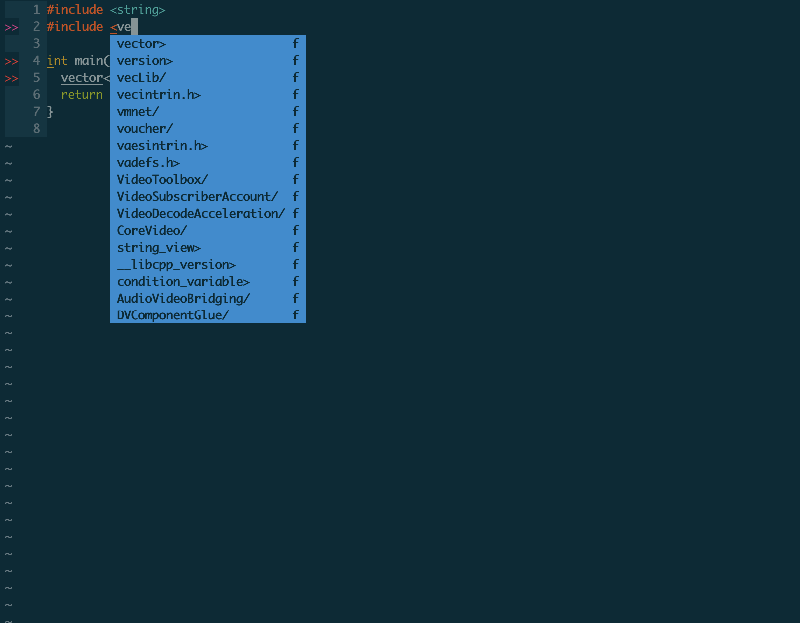
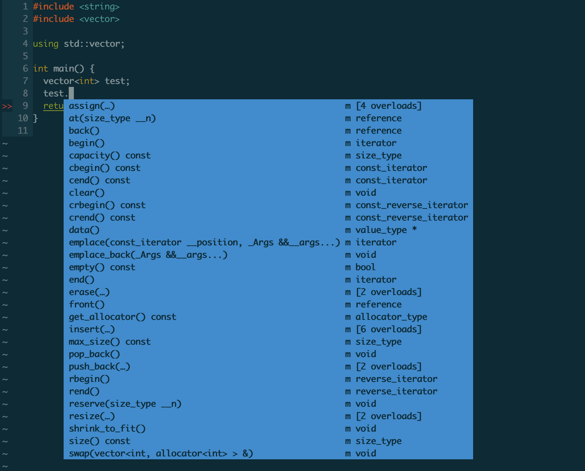
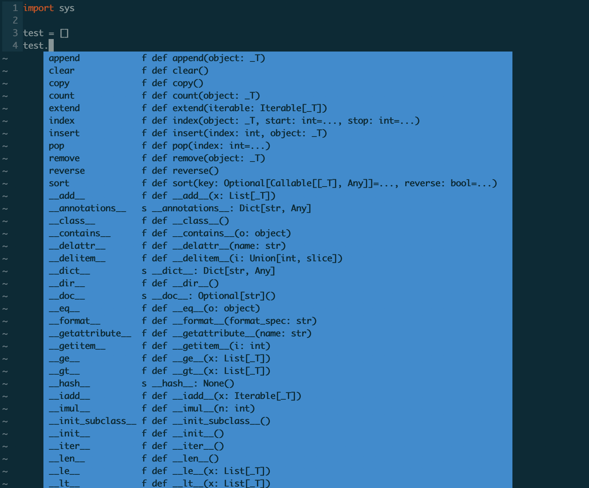
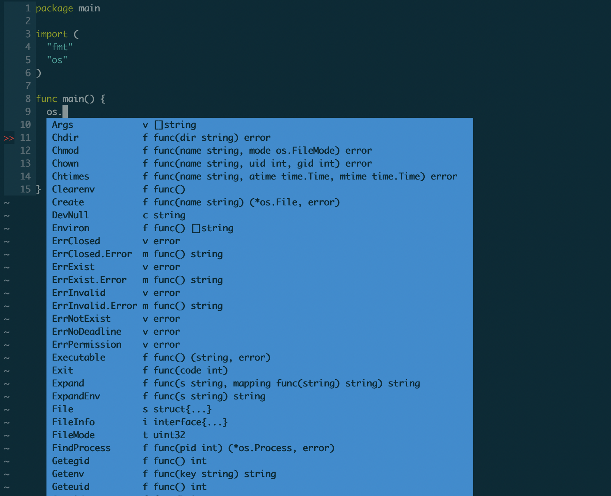
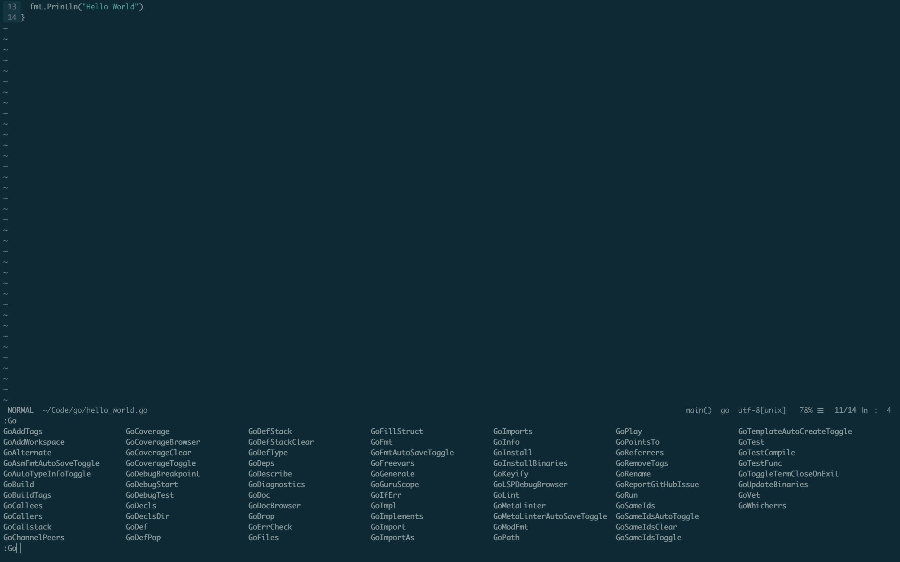

# vim-ide
vim ide, support c++, python, golang

# Install

1. clone vim-ide
```
git clone git@github.com:cicelprg/vim-ide.git
cd vim-ide && cp -r .vimrc .vim  ~/
```

2. install vundle
```
git clone https://github.com/gmarik/vundle.git ~/.vim/bundle/vundle
```

3. install all plugin
```
:PluginInstall
```

4. install YCM, Reference: https://github.com/ycm-core/YouCompleteMe
```
cd ~/.vim/bundle/YouCompleteMe/ && ./install.py --clangd-completer --go-completer
```

5. install go binaries
```
:GoInstallBinaries
```

# Effect

## C++





Format Code (use google cpp style):
```
:ClangFormat
```

## Python



## GO






